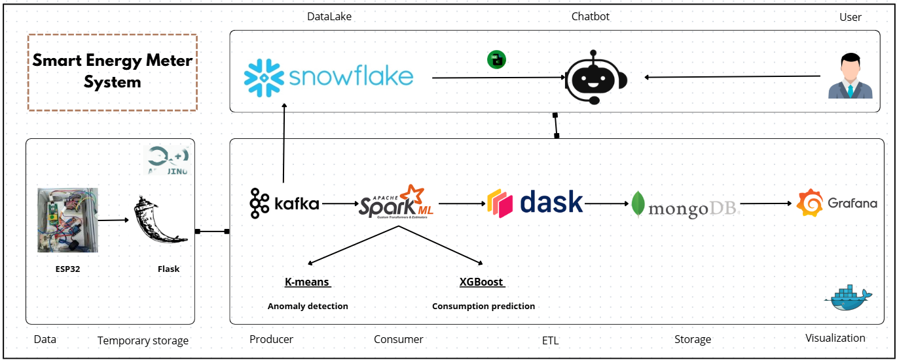

# Big Data Project - Smart Energy Meter System

This project implements a smart energy meter system, using various big data tools and machine learning models. The system collects energy consumption data through an **ESP32** (programmed with **Arduino IDE**) and stores it temporarily in **Flask**. The data is then processed through **Kafka**, **Spark**, **Dask**, and stored in **MongoDB** for further analysis. Finally, **Grafana** is used for visualizing the energy consumption trends.

### ESP32 Hardware Setup


## Project Architecture



### Architecture Overview:
1. **ESP32 + Arduino IDE**: Collects energy consumption data and temporarily stores it in **Flask**.
2. **Flask**: Acts as an intermediary, receiving and storing the data temporarily before it is passed to **Kafka**.
3. **Kafka Producer**: Sends data from Flask to Kafka, which is then consumed by the **Kafka Consumer**.
4. **Spark Consumer**: Processes the data from Kafka, performing transformations and analyzing it.
5. **Dask**: Used for ETL (Extract, Transform, Load) tasks for large-scale data processing.
6. **MongoDB**: Data is stored in MongoDB for later analysis.
7. **Grafana**: Visualizes the energy consumption data in real-time.

## Project Structure

```
Big_Data_Project_Smart_Energy_Meter_System/
├── checkpoint/                    # Checkpoints of models during training
├── kmeans_model/                  # KMeans clustering model for energy data
├── results_combined/              # Combined results and predictions
├── Architecture.png               # Architecture diagram of the system
├── Dask.py                         # Dask script for parallel processing
├── Spark_ML_Consumer.py           # Spark ML model for consumption prediction
├── Spark_ML_Reader.py             # Spark reader for consuming data
├── consumer_snowflake.py          # Script for processing data from Snowflake
├── docker-compose.yaml            # Docker Compose configuration for containers
├── esp32 program.ino              # Arduino code for ESP32 energy data collection
├── esp32.jpg                      # Image of the ESP32 hardware setup
├── producer.py                    # Script for producing data to be consumed
├── xgb_energy_model.json          # Trained XGBoost energy consumption model
└── README.md                      # Project documentation
```

## Setup and Run

1. **Clone the repository**:

    ```bash
    git clone https://github.com/Majda8/Big_Data_Project_Smart_Energy_Meter_System.git
    ```
    
    ```bash
     cd Big_Data_Project_Smart_Energy_Meter_System
    ```


2. **Run the system**:

    The system can be started using Docker. Run the following command:

    ```bash
    docker-compose up -d
    ```

3. **Upload the ESP32 Program**:

    Upload the **ESP32 program** from `esp32 program.ino` to your ESP32 device using the Arduino IDE. This collects energy data and sends it to Flask.
Voici la partie demandée ajoutée avec les instructions pour le **setup et l'exécution** des scripts :

---

## Setup and Run

1. **Clone the repository**:

    ```bash
    git clone https://github.com/Majda8/Big_Data_Project_Smart_Energy_Meter_System.git
      ```
    
    ```bash
    cd Big_Data_Project_Smart_Energy_Meter_System
    ```

2. **Run the system**:

    The system can be started using Docker. Run the following command:

    ```bash
    docker-compose up -d
    ```

3. **Upload the ESP32 Program**:

    Upload the **ESP32 program** from `esp32 program.ino` to your ESP32 device using the **Arduino IDE**. This collects energy data and sends it to Flask.
   
5. **Running other Python scripts**:

    For the other Python scripts (like `Dask.py`, `producer.py`, and `consumer_snowflake.py`), you can simply run them directly:

    ```bash
    python Dask.py
    python producer.py
    python consumer_snowflake.py
    ```

5. **Run the Spark scripts**:

    For the Spark scripts, use the following Docker commands to run the consumer and reader scripts:

    ```bash
    docker exec -it spark-master /opt/bitnami/spark/bin/spark-submit --packages org.apache.spark:spark-sql-kafka-0-10_2.12:3.3.0 /app/Spark_ML_consumer.py
    ```

    ```bash
    docker exec -it spark-master /opt/bitnami/spark/bin/spark-submit --packages org.apache.spark:spark-sql-kafka-0-10_2.12:3.3.0 /app/Spark_ML_reader.py
    ```


---

Cela décrit comment cloner, configurer, exécuter les conteneurs Docker, uploader le programme ESP32 et utiliser les commandes Spark via Docker.


This project integrates IoT devices, big data processing, machine learning, and real-time visualization to create a smart energy meter system. The system is scalable and can efficiently process large datasets, providing insights into energy consumption patterns.
